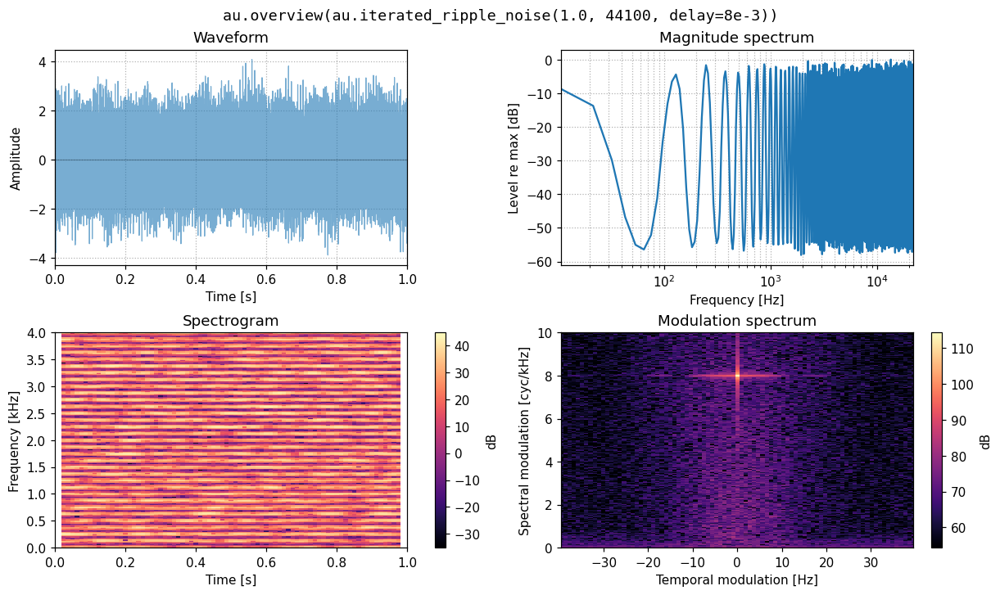
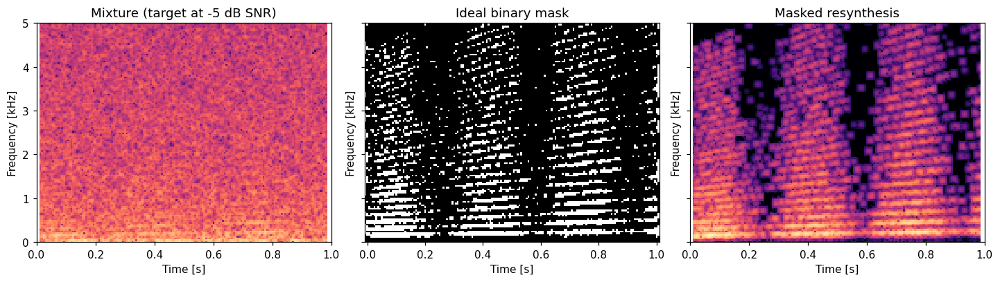
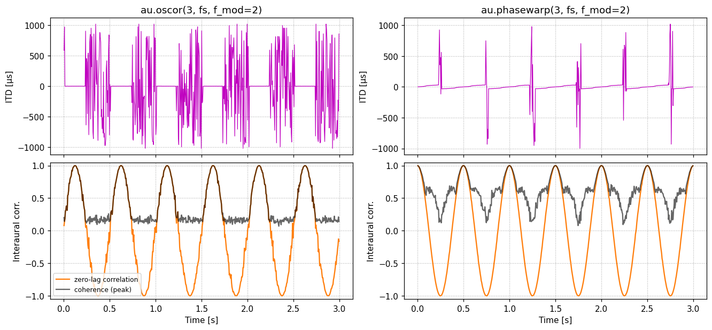
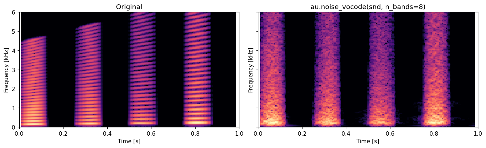

# audstim

**Signals and stimuli for auditory research, built for Jupyter.**

audstim is a small Python library for making, manipulating, and analyzing sounds
the way hearing scientists think about them: tones and complexes, shaped and
correlated noises, ERB-spaced subbands, invertible spectrograms, interaural
cues, HRIR spatialization of moving sources, and synthetic room reverberation.
Levels are written as levels (`snd + 6*dB`), times as seconds (`snd[0.1:0.5]`),
and any sound at the end of a notebook cell plays.



## What it's for

- **Psychophysical stimuli.** Pure tones, harmonic complexes with any phase
  scheme (cosine, sine, alternating, random, Schroeder±), band-limited square,
  sawtooth and pulse trains, chirps, band-limited and spectrally tilted noise,
  iterated rippled noise. Everything is reproducible from a seed.
- **Binaural and spatial hearing.** Exact fractional ITDs, ILDs, interaurally
  correlated noise, Oscor and Phasewarp, windowed ITD/ILD/coherence analysis
  (broadband or per band), and rendering of static or moving sources through
  measured HRIRs (PKU-IOA or any SOFA file).
- **Speech in noise.** Speech-shaped noise from a long-term average spectrum,
  mixing at a target SNR, ideal binary and ratio masks with exact resynthesis.
- **Cochlear-implant and envelope/TFS studies.** A perfect-reconstruction ERB
  filterbank, Hilbert envelopes and fine structure, and a channel vocoder.
- **Rooms.** Synthetic impulse responses with frequency-dependent decay from the
  statistics of real rooms (Traer & McDermott, 2016), with a controllable DRR
  and decorrelated binaural tails.
- **Teaching and demos.** One-call overview plots (waveform, spectrum,
  spectrogram, modulation spectrum) next to an audio player.

audstim is not an experiment runner and does not calibrate to dB SPL; see
[Related projects](#related-projects) for those.

## Install

```bash
git clone https://github.com/choyun1/audstim
cd audstim
pip install -e ".[notebook]"    # extras: sofa (HRIR files), play (sounddevice), dev (tests)
```

Requires Python ≥ 3.10, numpy, scipy ≥ 1.12, matplotlib, and soundfile.

## A short tour

```python
import audstim as au
from audstim import dB

fs = 44100

# Stimuli: every generator returns a Sound with RMS = 1
tone = au.pure_tone(0.5, fs, 1000).ramp(10e-3)
complex_ = au.harmonic_complex(0.5, fs, f0=200, harmonics=range(1, 21), phases="schroeder+")
noise = au.gaussian_noise(0.5, fs, band=(100, 8000), tilt=-3, rng=0)  # pink, band-limited

# Levels are dB units: + changes level, + with a Sound mixes
target_in_noise = tone + (noise + 5 * dB)  # tone at -5 dB SNR
quieter = complex_ - 12 * dB

# Time is in seconds
middle = target_in_noise[0.1:0.4]

# Binaural: positive ITD/ILD = toward the right
lateral = au.apply_itd_ild(noise, itd=300e-6, ild=6)
cues = au.interaural_cues(lateral, win_dur=20e-3)
cues.plot()

# Analysis
au.overview(target_in_noise)  # waveform, spectrum, spectrogram, modulation spectrum
target_in_noise  # in a notebook: an audio player
```

The [recipes notebook](notebooks/recipes.ipynb) has worked examples of
everything below, including speech-shaped noise, moving sources with reverb,
and the classic binaural stimuli.

## Gallery

**Ideal binary mask.** A gliding harmonic target at −5 dB SNR, the IBM computed
from the separate STFTs, and the masked mixture resynthesized.



```python
S_t, S_m, S_x = (au.STFT(s, 25e-3) for s in (target, masker, target + masker))
separated = (S_x * au.ideal_binary_mask(S_t, S_m, lc_db=0)).to_sound()
```

**Oscor and Phasewarp** (Siveke et al., 2008). The zero-lag interaural
correlation follows sin and cos of the modulation rate, respectively.



**Noise vocoding.** Eight ERB-spaced bands; envelopes survive, harmonic fine
structure doesn't.



Figures are regenerated by `python docs/make_figures.py`.

## Conventions

| | |
|---|---|
| Sounds | `Sound` = immutable `(n_samples, n_channels)` float array + `fs`. Operations return new Sounds. |
| Arithmetic | `a + b` mixes, `a * b` multiplies sample-wise, `2 * a` scales, mono broadcasts to stereo. |
| Levels | `a + 6*dB`, `a - 3*dB`. Adding a bare number is an error, so it can't be mistaken for a DC offset. dB is always `20*log10(amplitude)`. |
| Time | `snd[0.1:0.5]` slices by seconds; `snd.data` for samples. |
| Randomness | Every stochastic function takes `rng=` (a seed or `np.random.Generator`). |
| Binaural | Positive ITD = right ear leads; positive ILD = right ear louder. |
| Space | Meters, head-centered, x = right, y = front, z = up. `hcc` = (distance cm, elevation °, azimuth ° clockwise from front). |
| Plots | Every plotting function takes an optional `ax` and returns it; global matplotlib settings are never touched. |

## What's in it

| Module | Contents |
|---|---|
| `sound` | `Sound`, `load` |
| `units` | `dB`, `Decibels` |
| `generators` | `silence`, `pure_tone`, `harmonic_complex`, `schroeder_complex`, `square_wave`, `sawtooth_wave`, `pulse_train`, `linear_chirp`, `exponential_chirp`, `gaussian_noise`, `correlated_noise`, `iterated_ripple_noise` |
| `processing` | `pad`, `truncate`, `concat`, `mix`, `normalize`, `match_fs`, `match_channels`, `relative_db`, `bandpass`, `butter_filter`, `amplitude_modulate` |
| `representations` | `Spectrum`, `long_term_spectrum`, `STFT` (exact inverse, fast Griffin-Lim), `Mask`, `ideal_binary_mask`, `ideal_ratio_mask`, `ModulationSpectrum` |
| `filterbank` | `ERBFilterbank`, `subbands`, `Subbands` (envelopes, TFS, synthesis), `noise_vocode` |
| `binaural` | `apply_itd_ild`, `simple_bir`, `interaural_cues`, `oscor`, `phasewarp` |
| `spatialization` | `HRIRSet` (PKU-IOA, SOFA; onset-aligned interpolation), `spatialize`, `move_sound`, trajectories, coordinate conversions, `distance_gain_db` |
| `reverb` | `synth_ir` |
| `plotting` | `overview` and the `plot_*` functions behind each object's `.plot()` |

## Related projects

- [slab](https://github.com/DrMarc/slab): sound manipulation and psychoacoustic
  experiments, with calibration and experiment tools. The closest overlap; use
  it if you need calibrated levels or trial sequencing.
- [PsychoPy](https://www.psychopy.org/): running experiments.
- [brian2hears](https://brian2hears.readthedocs.io/): auditory periphery models.
- [librosa](https://librosa.org/): music and audio analysis.
- [pyroomacoustics](https://github.com/LCAV/pyroomacoustics): geometric room simulation.
- [pyfar](https://pyfar.org/) / [sofar](https://github.com/pyfar/sofar): acoustics and SOFA files.

## Roadmap

- Sound texture synthesis from auditory statistics (McDermott & Simoncelli, 2011).
- A high-quality speech analysis/resynthesis model with robust F0 tracking
  (STRAIGHT, Kawahara et al., 1999, or its open successor WORLD, Morise et al., 2016).
- Faster `move_sound` via batched frequency-domain filtering.
- On-demand download of public HRIR databases.
- Differentiable (JAX) versions of the core renderers.

## References

- Glasberg & Moore (1990). Derivation of auditory filter shapes from notched-noise data. *Hearing Research* 47.
- Griffin & Lim (1984). Signal estimation from modified short-time Fourier transform. *IEEE TASSP* 32.
- McDermott & Simoncelli (2011). Sound texture perception via statistics of the auditory periphery. *Neuron* 71.
- Perraudin, Balazs & Søndergaard (2013). A fast Griffin-Lim algorithm. *IEEE WASPAA*.
- Qu et al. (2009). Distance-dependent head-related transfer functions measured with high spatial resolution using a spark gap. *IEEE TASLP* 17.
- Schroeder (1970). Synthesis of low-peak-factor signals and binary sequences with low autocorrelation. *IEEE Trans. Inf. Theory* 16.
- Shannon et al. (1995). Speech recognition with primarily temporal cues. *Science* 270.
- Siveke et al. (2008). Psychophysical and physiological evidence for fast binaural processing. *J. Neurosci.* 28.
- Traer & McDermott (2016). Statistics of natural reverberation enable perceptual separation of sound and space. *PNAS* 113.
- Wang (2005). On ideal binary mask as the computational goal of auditory scene analysis. In *Speech Separation by Humans and Machines*.
- Yost (1996). Pitch of iterated rippled noise. *JASA* 100.

## Migrating from sigtools

audstim was previously named `sigtools` (renamed to avoid a clash with an
unrelated PyPI package). The 0.2 rewrite also changed the API:

| sigtools 0.1 | audstim |
|---|---|
| `from sigtools.sounds import *` etc. | `import audstim as au` |
| `PureTone(dur, fs, f)`, `GaussianNoise(...)`, ... | `au.pure_tone(dur, fs, f)`, `au.gaussian_noise(...)`, ... |
| `GaussianNoise(dur, fs, lo, hi, tilt)` | `au.gaussian_noise(dur, fs, band=(lo, hi), tilt=...)`; tilt is now dB/octave |
| `SchroederPhase(dur, fs, f0, n)` | `au.schroeder_complex(dur, fs, f0, n)` |
| `SoundLoader(path)`, `Silence(dur, fs)` | `au.load(path)`, `au.silence(dur, fs)` |
| `snd + 6` (dB gain) | `snd + 6*dB` |
| `snd.make_binaural()`, `snd.extract_envelope()` | `snd.to_stereo()`, `snd.envelope()` |
| `ramp_edges(snd, d)` | `snd.ramp(d)` |
| `butter_bandpass_filter(snd, lo, hi)` | `au.bandpass(snd, lo, hi)` (no longer RMS-normalizes) |
| `equalize_fs`, `zeropad_sounds`, `center_sounds`, `truncate_sounds` | `au.match_fs`, `au.pad(align="start"/"center")`, `au.truncate` |
| `normalize_rms`, `zero_mean`, `concat_sounds`, `compare_relative_db` | `au.normalize`, `snd.zero_mean()`, `au.concat`, `au.relative_db` |
| `sum(zeropad_sounds([a, b]))` | `au.mix([a, b])` |
| `MagnitudeSpectrum(s).to_Noise(dur, fs)` | `au.long_term_spectrum(s).to_noise(dur, fs)` |
| `STFT(snd, win)`, `S.to_Sound()`, `method="GLA"` | `au.STFT(snd, win)`, `S.to_sound()`, `S.griffin_lim()` |
| `IBM = S_t > S_m + lc`; `IBM * S_mix` | `au.ideal_binary_mask(S_t, S_m, lc_db=lc)`; `S_mix * mask` |
| `Subbands(snd, n)`, `.extract_envelopes()`, `.to_Sound()` | `au.subbands(snd, n)`, `.envelopes()`, `.synthesize()` |
| `InterauralCues(snd, win)` | `au.interaural_cues(snd, win)` |
| `SimpleBIR(fs, itd, ild)` | `au.simple_bir(fs, itd, ild)` or `au.apply_itd_ild(snd, itd, ild)` |
| `SynthIR(drr, rt60, dB_thresh, fs)` | `au.synth_ir(rt60, fs, drr_db=..., decay_db=-dB_thresh)` |
| `move_sound(traj, snd)` | `au.move_sound(snd, traj, hrirs)` with `au.HRIRSet.from_pku_ioa(dir)` or `.from_sofa(path)` |
| `display_STFT(x, S)`, `AudioControl(snd).display()` | `au.overview(x)`; put `snd` at the end of a cell |

Results computed with 0.1 can differ, because these 0.1 bugs were fixed:
spectrum and STFT "dB" were half the true value; the bandpass filter filtered
stereo across channels; `SimpleBIR` was a sample short and got louder with
larger ITDs; `SynthIR`'s DRR had no effect and its resynthesis filters were
shifted in frequency; tone frequencies were off by a factor of `(n-1)/n`;
`move_sound` summed ~100 unwindowed overlapping convolutions per sample; and IAC
was never computed. The ILD in `apply_itd_ild` is now split ±ILD/2 across the
ears (0.1 applied it to the right ear only).

## Development

```bash
pip install -e ".[dev]"
pytest
ruff check . && ruff format .
```

## License and citation

MIT; see [LICENSE](LICENSE). If audstim is useful in your research, please cite
it using [CITATION.cff](CITATION.cff).
