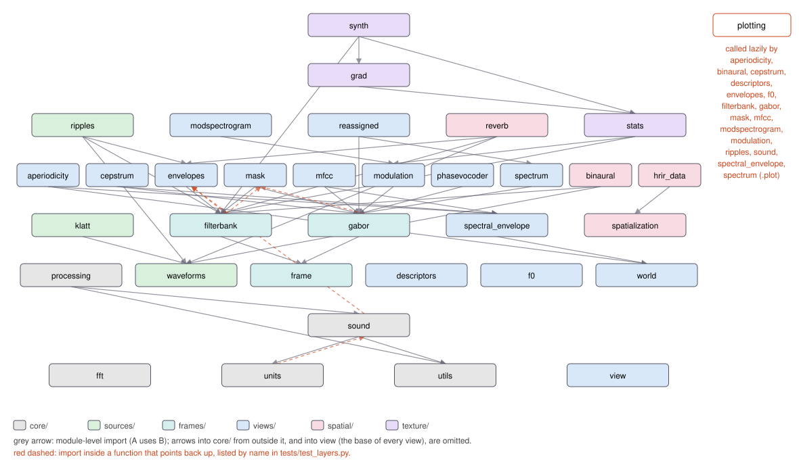

# Package layout

The folders follow meaning (docs/design/layout/sound-first.md has the reasons;
docs/design/layout/reorganization.md the earlier step):

| Folder | Modules | What it is |
|---|---|---|
| `core` | `sound`, `units`, `utils`, `fft`, `processing` | `Sound`, decibels, numeric helpers and frequency scales, FFT sizes and threads, and processing that needs no analysis (padding, mixing, filters, level changes) |
| `sources` | `waveforms`, `klatt`, `ripples` | sounds made from parameters alone: tones, noises, chirps and the LF source, Klatt's formant synthesizer, spectrotemporal ripples |
| `frames` | `frame`, `filterbank`, `gabor` | invertible analyses and their coefficients, with exact least-squares resynthesis of changed coefficients |
| `views` | `view`, `spectrum`, `reassigned`, `envelopes`, `mask`, `modulation`, `modspectrogram`, `cepstrum`, `mfcc`, `f0`, `spectral_envelope`, `aperiodicity`, `world`, `phasevocoder` | one-way analyses, each saying what it drops, with the routes back to sound they have: the channel vocoder (in `envelopes`), WORLD's synthesis, the phase vocoder |
| `spatial` | `binaural`, `spatialization`, `hrir_data`, `reverb` | two ears, heads and rooms |
| `texture` | `stats`, `grad`, `synth` | sound texture statistics and synthesis |

`plotting.py` holds the `plot_*` functions and `overview`, and is imported only
inside `.plot()` methods.
Every view and every analysis result that is not a view (`Sound`, `STFT`,
`TVSTFT`, `Subbands`) has `.plot()`; a view with no single picture keeps
`View.plot`, which refuses with its `no_plot` sentence naming what to plot
instead (docs/design/layout/plotting.md).

Import order is kept module by module, not by folder: `sources/ripples`
imports frames and views, and views import `core`. `tests/test_layers.py`
fails when the module-level imports form a cycle, or when `core` imports
anything outside `core` at module level.

The diagram is drawn from the source by `python tools/draw_layout.py`, and
`tests/test_layers.py` fails when it is out of date. Each module sits one row
above the highest module it imports at module level, so grey arrows point
down; the colour is its folder.

The red dashed arrows are imports inside a function that point back up. They
exist so that calls chain in a notebook: `Sound.envelope()` returns an
`Envelope`, `Subbands.envelopes()` returns `Envelopes`, and `STFT * mask`,
`TVSTFT * mask` and `Subbands * mask` take a `Mask`; `Sound * dB` is
refused with a hint. None of them runs at import, so they close no cycle
there; all of them are listed by name in the test,
so a new one has to be added there on purpose. Every `.plot()` reaches into
`plotting` the same way.

WORLD's synthesis sits in `views` beside its analysis, so CheapTrick and D4C
take WORLD's internals from a neighbour. It reads an F0 track as `.t` and
`.f0`, an envelope as `env(t, f)` and an aperiodicity as its grid, rather
than checking their types, as `harmonic_complex` and `klatt_synthesize` do.

A name with a leading underscore is internal to sonore: it may be imported
between sonore's modules, across folders too (`Envelopes` builds on the
filterbank's `_PaddedBands`), but it is never part of the API, never in
`__all__`, and may change without notice. Only names without an underscore are for users.

`import sonore as so` re-exports the public names from every folder, so
code written against `so.` doesn't need to know where anything lives. The
texture names stay under `so.texture`; synthesis is `sonore.texture.synth`.
